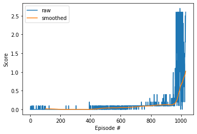

# report of the model and its performance

## model
Two agents are trained with Deep Deterministic Policy Gradient (DDPG),
which is suitable for tasks with continuous action space.
Each agent corresponds for each player
and they share neural network weights.

### neural network architecture
In DDPG method, an agent has two networks, actor and critic.
The actor network is to give actions to be taken,
with observed states as input variables.
Another network, critic, is to give a state-value function,
which is used to give target values for the actor network training.
Both actor and critic networks are feed forward networks
with fully connected layers.
They have two hidden layers of 256 units
and the second hidden layer of the critic network has additional inputs
for action values.

### epsilon-greedy method
In training phase, agents are forced to take random actions
with a certain probability for each time step.
The probability is denoted as epsilon,
where its initial value is 1
and is decreased by a constant rate of 0.9995
until it reaches the minimum value of 0.01.
This helps to accumulate various experience.
The decay constant value is tunes so that the agents
can learn within a proper term;
if the value is too small, or close to 0, the agents start to act
based on their experience before they accumulate enough successful experience,
and they can will never act well.
On the other side, if the decay constant value is too large, or close to 1,
they always take random action and the learning process will be too long.

## performance
Here is an example of learning history of the agents.
As given in the project instruction,
score of each episode is defined as larger one between the two agents.
"Smoothed" graph is moving average over last 100 consecutive episodes.
It starts to increase at around 400th episode,
shows rapid increase at around 900th episode,
and finally achieved mean score over the last 100 episodes of 1
at around 1030th episode,
which is much higher than requirment of this project.

The gif file "demo.gif" shows performance of the trained agents.
In this example, 10 games (or episodes) are played,
and the mean score is 1.55.
Here, the agents act only based on their policy and do not take random action at all.
In some episodes, they get almost no rewards, or fail to hit the ball at the very beginning,
but in other episodes, they keep rally over several ten times.

## possible future improvement
